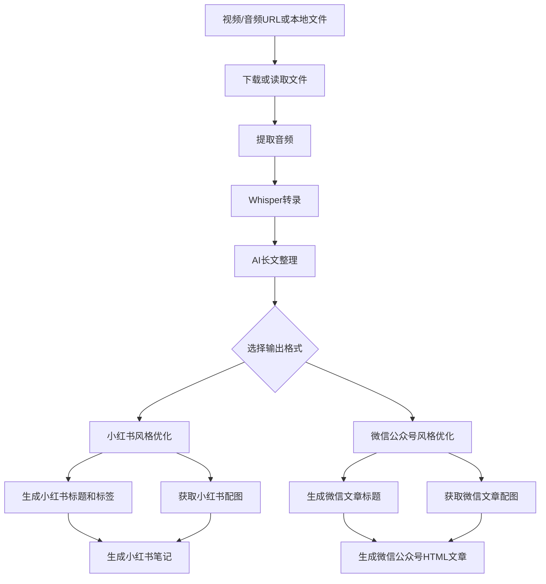

# 文章笔记生成器 (Article Note Generator)

🎥 一键将视频音频内容转换为优质小红书笔记、微信公众号文章，自动优化内容和配图


## 👤 作者信息

- **作者**：玄清
- **博客**：[天天悦读](https://blog.example.com)
- **Email**：grow8org@gmail.com
- **GitHub**：[whotto/Video_note_generator](https://github.com/whotto/Video_note_generator)

## 🎯 应用场景

- **内容创作者**：快速将视频/音频内容转换为小红书笔记和微信公众号文章
- **知识管理者**：自动整理视频音频笔记和学习要点
- **社交媒体运营**：批量生成优质小红书笔记和微信公众号文章

## ✨ 功能特点

### 📱 小红书笔记特点

- **标题创作**：
  - 使用二极管标题法，抓住用户痛点
  - 融入高转化词和情感词
  - 添加2-4个相关表情
  - 控制在20字以内

- **内容优化**：
  - 正文控制在600-800字
  - 每段使用emoji引导
  - 设置2-3处互动引导
  - 加入个人经验和共情描述
  - 自动获取相关配图

- **标签系统**：
  - 核心关键词
  - 关联长尾词
  - 高转化标签
  - 热门话题标签

### 📰 微信公众号文章特点

- **内容结构**：
  - 精炼清晰，800-2000字
  - 3-5小标题，逻辑分明
  - 段落简短（2-5行），适合碎片化阅读

- **语气风格**：
  - 口语化、贴近读者
  - 灵活运用轻松幽默/情感共鸣/专业严谨等风格
  - 强互动性，文末常用提问、评论引导

- **视觉吸引**：
  - 封面图精美，文中插图合理
  - 排版简洁美观，关键词加粗
  - 自动从Unsplash获取相关配图并保存到本地

- **价值导向**：
  - 提供干货、情绪价值、共鸣感或实用技巧
  - 时效敏感，紧贴热点话题

## 🔄 创作流程



## 🚀 使用方式

支持三种使用方式：

1. **处理单个视频/音频**：
```bash
# 处理视频URL
python article_note_generator.py https://example.com/video

# 处理本地音频文件
python article_note_generator.py /path/to/audio.mp3

# 指定输出格式
python article_note_generator.py https://example.com/video --format xiaohongshu
python article_note_generator.py https://example.com/video --format wechat
python article_note_generator.py https://example.com/video --format both
```

2. **批量处理 URL 文件**：
```bash
# urls.txt 文件，每行一个视频/音频链接
python article_note_generator.py urls.txt
```

3. **处理 Markdown 文件**：
```bash
# 支持 Markdown 链接和直接 URL
python article_note_generator.py notes.md
```

4. **HTML预览功能**：
```bash
# 预览任意 Markdown 文件
python article_note_generator.py your_file.md --preview

# 预览生成的笔记
python article_note_generator.py temp_notes/20250702_234851_xiaohongshu.md --preview
```

## 🛠️ 使用工具

- [FFmpeg](https://ffmpeg.org/) - 音视频转换
- [Whisper](https://github.com/openai/whisper) - 语音转文字
- [OpenRouter](https://openrouter.ai/) - AI 内容优化
- [Unsplash](https://unsplash.com/) - 高质量图片

## 📦 快速开始

### 1. 安装依赖

```bash
# 安装 FFmpeg
# Mac: brew install ffmpeg
# Windows: 从 ffmpeg.org 下载并添加到环境变量
# Linux: apt install ffmpeg

# 安装 Python 依赖
pip install -r requirements.txt

# 安装 Markdown 渲染依赖（可选，用于HTML预览）
pip install markdown

# 配置环境变量
cp .env.example .env
```

### 2. 配置 API 密钥

编辑 `.env` 文件，填入必要的 API 密钥：
```ini
# AI Provider 配置
AI_PROVIDER=openrouter

# OpenRouter API（推荐）
OPENROUTER_API_KEY=your-openrouter-api-key-here
OPENROUTER_MODEL=openai/gpt-3.5-turbo-1106

# 或者使用 Google Gemini API
# AI_PROVIDER=google
# GOOGLE_API_KEY=your-google-api-key-here

# Unsplash API（必需）
UNSPLASH_ACCESS_KEY=your-unsplash-access-key-here
UNSPLASH_SECRET_KEY=your-unsplash-secret-key-here
UNSPLASH_REDIRECT_URI=urn:ietf:wg:oauth:2.0:oob
```

### 3. 开始使用

1. 运行环境检查：
```bash
python check_environment.py
```

2. 处理单个视频/音频：
```bash
# 生成小红书笔记
python article_note_generator.py https://example.com/video --format xiaohongshu

# 生成微信公众号文章
python article_note_generator.py https://example.com/video --format wechat

# 使用特定微信公众号模板
python article_note_generator.py https://example.com/video --format wechat --wechat-template tech

# 同时生成两种格式
python article_note_generator.py https://example.com/video --format both

# 处理本地音频文件
python article_note_generator.py /path/to/audio.mp3
```

3. 批量处理：
```bash
# 创建 urls.txt 文件，每行一个视频/音频链接
python article_note_generator.py urls.txt
```

## 📄 输出文件

根据选择的输出格式，每个视频/音频会生成以下文件：

### 基础文件（总是生成）

1. **原始笔记** (`YYYYMMDD_HHMMSS_original.md`)：
   - 完整的音频转录文本
   - 保留所有细节内容
   - 包含来源信息

2. **整理版笔记** (`YYYYMMDD_HHMMSS_organized.md`)：
   - AI优化后的结构化内容
   - 重点内容突出
   - 段落优化，逻辑清晰

### 小红书格式文件（--format xiaohongshu 或 both）

3. **小红书版本** (`YYYYMMDD_HHMMSS_xiaohongshu.md`)：
   - 🔥 爆款标题（二极管标题法）
   - 📱 600-800字精华内容
   - 🖼️ 2-4张相关配图
   - 🏷️ 优化的标签系统
   - 💬 互动引导设计

4. **小红书HTML预览** (`YYYYMMDD_HHMMSS_xiaohongshu.html`)：
   - 📱 移动端友好设计
   - 🎨 优雅的标签样式
   - 📐 清晰的排版布局

### 微信公众号格式文件（--format wechat 或 both）🆕

5. **微信公众号版本** (`YYYYMMDD_HHMMSS_wechat.md`)：
   - 📰 吸引眼球的标题（15字内）
   - 📖 800-2000字深度内容
   - 📋 3-5个小标题，逻辑分明
   - 💡 段落简短，适合碎片化阅读
   - 🎯 强互动性，引导评论转发

6. **微信公众号HTML版本** (`YYYYMMDD_HHMMSS_wechat.html`)：
   - 📱 微信风格排版设计
   - 🖼️ 自动插入配图（每500字一张）
   - 🎨 专业的视觉效果
   - 📐 适配移动端阅读体验
   - 🎭 11种精美模板可选（详见[模板指南](TEMPLATE_GUIDE.md)）

## 🎨 微信公众号模板

文章笔记生成器支持11种精美的微信公众号模板风格：

1. **default** - 基础模板：简洁大方的白底黑字风格
2. **modern** - 现代风格：时尚简约的蓝色主题
3. **tech** - 技术专栏：类似GitHub风格的技术文档样式
4. **mianpro** - mianpro风格：温暖活泼的粉红色调
5. **lapis** - 蓝宝石主题：优雅简洁的蓝色主题
6. **maize** - 玉米黄主题：温暖活泼的黄色主题
7. **orangeheart** - 橙心主题：热情洋溢的橙色主题
8. **phycat** - 物理猫主题：清新自然的青色主题
9. **pie** - 派主题：简约现代的紫灰主题
10. **purple** - 紫色主题：高贵典雅的紫色主题
11. **rainbow** - 彩虹主题：缤纷多彩的彩虹渐变主题

使用方法：
```bash
python article_note_generator.py https://example.com/video --format wechat --wechat-template tech
```

查看所有模板预览：
```bash
# 在浏览器中打开模板预览页面
open template_preview.html
```

详细说明请参阅[模板指南](TEMPLATE_GUIDE.md)。

## 🖼️ 图片管理功能

### 自动图片下载与本地保存

文章笔记生成器会自动从Unsplash获取高质量配图，并同时保存到本地：

- **在线显示**：生成的HTML文件中使用在线图片URL，确保最佳显示效果
- **本地备份**：所有图片同时保存到程序目录下的 `unsplash/` 文件夹
- **智能命名**：本地图片文件名包含图片ID和搜索关键词，便于管理
- **避免重复**：相同图片不会重复下载，节省存储空间和网络流量

### 本地图片文件夹结构

```
项目根目录/
├── unsplash/                    # 图片本地存储文件夹
│   ├── abc123_technology.jpg    # 图片ID_搜索词.jpg
│   ├── def456_business.jpg
│   └── ghi789_education.jpg
├── temp_notes/                  # 生成的笔记文件
└── ...
```

### 图片获取流程

1. **智能翻译**：将中文搜索词翻译为英文，提高搜索准确性
2. **多关键词搜索**：使用多个相关关键词分别搜索，获得更丰富的图片选择
3. **质量筛选**：只获取高质量、横版图片，适合文章配图
4. **本地保存**：下载图片到本地 `unsplash/` 文件夹，文件名包含图片ID和搜索关键词
5. **URL返回**：返回在线图片URL用于HTML显示，确保最佳加载速度

### 测试图片下载功能

可以使用提供的测试脚本验证图片下载功能：

```bash
python test_unsplash_download.py
```

该脚本会：
- 测试Unsplash API连接
- 下载示例图片到本地
- 显示本地文件夹内容
- 验证图片文件大小

## ⚙️ 配置说明

在 `.env` 文件中可以调整以下参数：

```ini
# 内容生成配置
MAX_TOKENS=2000          # 生成小红书内容的最大长度
CONTENT_CHUNK_SIZE=2000  # 长文本分块大小（字符数）
TEMPERATURE=0.7          # AI 创造性程度 (0.0-1.0)

# 代理设置（可选）
# HTTP_PROXY=http://127.0.0.1:7890
# HTTPS_PROXY=http://127.0.0.1:7890
```

## 📄 许可证

MIT License

## 🙏 鸣谢

感谢以下开源项目：
- [Whisper](https://github.com/openai/whisper)
- [FFmpeg](https://ffmpeg.org/)
